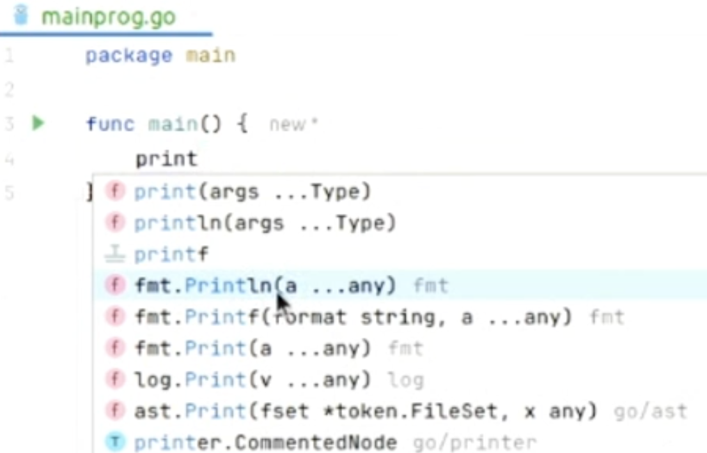

## Go Lang 

> Go Land IDE auto generted ```mod file``` is not correct 

Better option would be to use ```go init swamy.com/GoProject```

For regular print/println, use the functions from ```fmt ``` package 


In Go, strings are enclosed in double quotes. [rune]

#### Note 
> Variables starting with a capital letter gets exported. Otherwise it is private to the package. 

> This applies to functions also: Only functions starting with a capital letter can be accessed from outside the package. 


